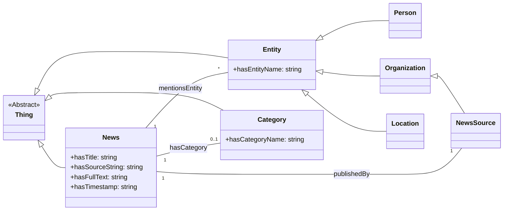

## News Ontology Structure

This document outlines the structure of the news ontology used in this project. The ontology is designed to represent news articles, the entities they mention, their categories, and sources.

### Core Concepts

The ontology is built around three primary base classes, all inheriting from `owl:Thing`:

1.  **News**: Represents individual news articles.
2.  **Entity**: Represents named entities that can be mentioned in news articles (e.g., people, organizations, locations).
3.  **Category**: Represents the topics or classifications of news articles (e.g., Sports, Politics).

### Class Hierarchy

#### Entity Subclasses

The `Entity` class has several more specific subclasses:

*   **Person**: Represents individual people.
*   **Organization**: Represents organizations, companies, institutions, etc.
    *   **NewsSource**: A specific type of `Organization` that publishes news (e.g., a newspaper, a news agency).
*   **Location**: Represents geographical places.

### Properties

The ontology defines two types of properties: Data Properties (attributes) and Object Properties (relationships).

#### Data Properties

Data properties link individuals to literal values (e.g., strings, numbers).

*   **`hasTitle`**:
    *   Domain: `News`
    *   Range: `xsd:string`
    *   Description: The title of the news article.
*   **`hasSourceString`**:
    *   Domain: `News`
    *   Range: `xsd:string`
    *   Description: The literal name of the news source as a string.
*   **`hasFullText`**:
    *   Domain: `News`
    *   Range: `xsd:string`
    *   Description: The full text content of the news article.
*   **`hasTimestamp`**:
    *   Domain: `News`
    *   Range: `xsd:string` (can be adapted to `xsd:dateTime`)
    *   Description: The publication timestamp of the news article.
*   **`hasEntityName`**:
    *   Domain: `Entity`
    *   Range: `xsd:string`
    *   Functional: Yes (an entity has one canonical name in this model)
    *   Description: The name of an entity (e.g., "John Doe", "United Nations", "Paris").
*   **`hasCategoryName`**:
    *   Domain: `Category`
    *   Range: `xsd:string`
    *   Functional: Yes
    *   Description: The name of a category (e.g., "Sports", "Technology").

#### Object Properties

Object properties link individuals to other individuals.

*   **`publishedBy`**:
    *   Domain: `News`
    *   Range: `NewsSource`
    *   Description: Links a news article to the news source that published it.
*   **`hasCategory`**:
    *   Domain: `News`
    *   Range: `Category`
    *   Description: Links a news article to its category.
*   **`mentionsEntity`**:
    *   Domain: `News`
    *   Range: `Entity`
    *   Description: Links a news article to an entity mentioned within it.

### Mermaid Diagram

The following diagram visualizes the class hierarchy and key relationships in the ontology:

This structure allows for querying news articles based on their content, mentioned entities, sources, and categories, facilitating knowledge graph construction and